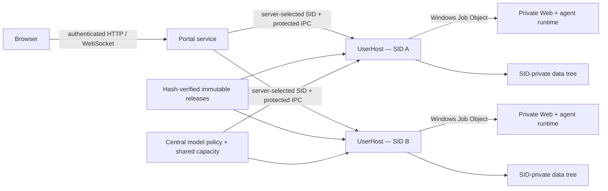

# WorkAgent2

WorkAgent2 is a centrally hosted, browser-accessible multi-user AI agent platform for Windows. It separates agent execution from personal computers, gives each user an isolated workspace, and centralizes model access, shared capacity, domain tools, and operational policy.

The repository contains the Windows control plane, per-user runtime supervisor, stable agent launchers, provider integration, persistence, and release-contract code.

## Why WorkAgent2

- **Browser-first access:** users reach their workspace from a browser while agent processes run on centrally managed infrastructure.
- **Per-user isolation:** Windows SID identity, private data roots, ACLs, loopback listeners, and Job Objects keep user workspaces and process trees separated.
- **Centralized model access:** provider credentials, model catalogs, aliases, quotas, and usage accounting are managed consistently instead of being configured independently on every endpoint.
- **Resumable employee onboarding:** account creation runs as an isolated per-user job, streams privileged milestones over protected IPC, and can safely resume after profile or bootstrap failures.
- **Shared capacity:** centrally managed runtimes reduce duplicated desktop resource use and make capacity available independently of whether a user's personal computer remains online.
- **Model-native interfaces:** the platform preserves the agent and tool interfaces expected by modern models, adding only the context and policy needed for domain workflows.
- **Operational control:** immutable release manifests, protected version pointers, health checks, idle collection, upgrade contracts, and rollback-aware state make runtime behavior observable and repeatable.
- **Streaming support:** the portal handles ordinary HTTP, WebSocket traffic, and streamed model responses without exposing internal credentials to the browser.

## Architecture



The portal authenticates browser requests and resolves each session to a server-managed Windows SID. Filesystem, credential, OAuth, project, runtime, and process operations remain inside the corresponding UserHost boundary. Browser-supplied host paths and internal credentials are never treated as authority.

See [docs/ARCHITECTURE.md](docs/ARCHITECTURE.md) for component responsibilities, trust boundaries, and core invariants.

## Repository map

| Path | Purpose |
|---|---|
| `cmd/aionui-portal` | Windows portal service entry point |
| `cmd/aionui-userhost` | Per-SID runtime supervisor entry point |
| `cmd/portal` | Administrative CLI entry point |
| `cmd/aion-agent-cli` | Stable agent launcher and release verifier |
| `internal/portal` | Authentication, sessions, HTTP/WebSocket proxying, quotas, and UI delivery |
| `internal/admin` | Privileged account provisioning, validation, and recovery orchestration |
| `internal/provisionipc` | Bounded progress protocol for resumable employee provisioning jobs |
| `internal/userhost` | Private runtime lifecycle, credentials, OAuth, projects, and agent defaults |
| `internal/winutil` | Windows accounts, ACLs, Job Objects, profiles, restricted tokens, and processes |
| `internal/release` | Immutable release validation and version-pointer management |
| `internal/store` | SQLite persistence for users, sessions, bindings, policies, and usage |
| `internal/cliproxy` | Provider provisioning, catalog convergence, and management transport |
| `scripts` | Build and release-contract scripts |
| `patches` | Reproducible source patches for independently maintained agent runtimes |

## Build and test

Requirements:

- Windows 10/11 or Windows Server
- Go 1.26 or newer
- PowerShell 7 for the release-contract scripts

Run all Go tests:

```powershell
go test ./...
```

Build the primary executables:

```powershell
go build ./cmd/aionui-portal
go build ./cmd/aionui-userhost
go build ./cmd/aion-agent-cli
go build ./cmd/portal
```

Windows service identity, ACL inheritance, filesystem quotas, TLS, OAuth callbacks, provider connectivity, firewall policy, process races, upgrades, and rollback should also be verified in the target environment before production use.

## Runtime extensions

The platform keeps third-party runtimes independently upgradeable. Source-level extensions are published as reviewable patches instead of copied source trees or binaries:

- AionCore `v0.1.42`: conversation fork and steering, channel commands, WeChat media and completion delivery, resumable uploads, built-in help, idle routing, project classification, persistence, and tests.
- Kimi Code `v0.29.1`: authenticated ACP session fork and active-turn steering support.

Application and license details are documented in [patches/README.md](patches/README.md).

## Security model

WorkAgent2 follows several core rules:

1. A Windows SID—not a browser-supplied username or path—is the tenant identity.
2. The portal owns browser authentication and routing; private host operations belong to UserHost.
3. Shared releases are immutable and verified against manifests before launch.
4. Secrets must not appear in browser responses, logs, shared releases, or process arguments.
5. Internal runtimes listen on loopback and remain bound to the owning user's route.
6. Public origin, TLS, cookies, callbacks, listeners, and health probes are treated as one transport contract.

Security reporting guidance is in [SECURITY.md](SECURITY.md).

## License

Copyright © 2026 linziyan1231. All rights reserved.

WorkAgent2 is source-available under the [Personal and Internal Non-Monetized Source License](LICENSE). Personal use and internal use within one legal entity are permitted, including internal modification and deployment. Selling, sublicensing, external distribution, customer-facing hosting, SaaS, and use as a component of a revenue-generating external product or service are prohibited.

This is a custom source-available license and is not an OSI-approved open-source license. Third-party dependencies remain under their own licenses as described in [THIRD_PARTY_NOTICES.md](THIRD_PARTY_NOTICES.md).

## 中文简介

WorkAgent2 是一个集中托管、通过浏览器访问的 Windows 多用户 AI Agent 平台。平台让 Agent 独立运行在统一管理的基础设施上，为每位用户提供基于 Windows SID 的隔离工作区，并集中管理模型访问、共享容量、行业工具、配额和运行策略。

项目允许个人使用和单一企业法人内部使用，包括内部修改、部署和效率提升；禁止出售、分许可、组织外传播、客户交付、收费托管、SaaS，以及用于对外营利的产品或服务。完整条款以 [LICENSE](LICENSE) 为准。
