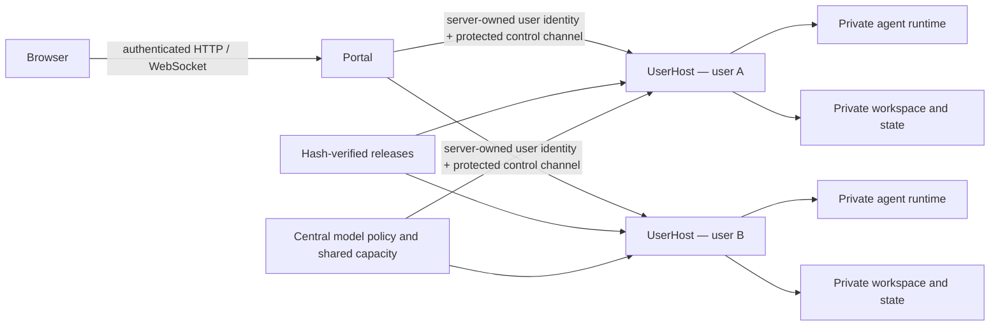

# WorkAgent2

WorkAgent2 is a centrally hosted, browser-accessible multi-user AI agent platform with Windows and Linux implementations. It separates agent execution from personal computers, gives each user an isolated workspace, and centralizes model access, shared capacity, domain tools, and operational policy.

## Why WorkAgent2

- **Browser-first access:** users reach their workspace from a browser while agent processes run on centrally managed infrastructure.
- **Per-user isolation:** Windows SID and Job Object boundaries or Linux UID, ACL, cgroup, Unix socket, and XFS project-quota boundaries isolate workspaces and process trees.
- **Centralized model access:** provider credentials, model catalogs, aliases, quotas, and usage accounting are managed consistently.
- **Resumable onboarding:** account creation runs as an isolated per-user job and can safely resume after profile or bootstrap failures.
- **Shared capacity:** centrally managed runtimes remain available independently of personal computers and reduce duplicated endpoint resource use.
- **Model-native interfaces:** the platform preserves the agent and tool interfaces expected by modern models while adding workflow context and policy.
- **Operational control:** immutable releases, health checks, idle collection, upgrade contracts, and rollback-aware state make runtime behavior observable and repeatable.

## Repository layout

```text
WorkAgent2/
├─ windows/          # Windows implementation
├─ linux/            # Linux implementation
├─ patches/          # Shared runtime patches and license references
├─ docs/             # Cross-platform architecture documentation
├─ README.md
└─ LICENSE
```

The platform implementations are independent Go modules and can be built and tested separately:

| Path | Purpose |
|---|---|
| [`windows/`](windows/README.md) | Windows portal, per-SID UserHost, administrative CLI, runtime supervisor, build scripts, and tests |
| [`linux/`](linux/README.md) | Linux control plane, per-user services, deployment templates, runtime assembly, and tests |
| [`patches/`](patches/README.md) | Reviewable extensions for independently maintained agent runtimes |
| [`docs/`](docs/ARCHITECTURE.md) | Shared architecture, platform boundaries, and common invariants |

## Architecture

Both implementations use the same high-level separation:



The portal authenticates and routes browser requests. Filesystem, credentials, OAuth, project, runtime, and process operations remain in the corresponding per-user host boundary. See [the cross-platform architecture](docs/ARCHITECTURE.md), [Windows architecture](windows/docs/ARCHITECTURE.md), and [Linux architecture](linux/docs/ARCHITECTURE.md).

## Build and test

### Windows

Requirements: Windows 10/11 or Windows Server, Go 1.26 or newer, and PowerShell 7 for release-contract scripts.

```powershell
cd windows
go test ./...
go build ./cmd/aionui-portal
go build ./cmd/aionui-userhost
go build ./cmd/aion-agent-cli
go build ./cmd/portal
```

### Linux

Run from a supported Linux host:

```bash
cd linux
go test ./...
go vet ./...
```

Production deployment also requires platform-specific verification of identities, filesystem isolation, quotas, TLS, callbacks, firewall policy, provider connectivity, upgrades, and rollback behavior.

## Runtime extensions

Third-party runtimes remain independently upgradeable. Source-level extensions are published as reviewable patches rather than copied source trees or binaries. Application and license details are documented in [patches/README.md](patches/README.md).

## License

Copyright © 2026 linziyan1231. All rights reserved.

WorkAgent2 is source-available under the [Personal and Internal Non-Monetized Source License](LICENSE). Personal use and internal use within one legal entity are permitted, including internal modification and deployment. Selling, sublicensing, external distribution, customer-facing hosting, SaaS, and use as a component of a revenue-generating external product or service are prohibited.

This is a custom source-available license and is not an OSI-approved open-source license. Third-party dependencies remain under their own licenses as described in [THIRD_PARTY_NOTICES.md](THIRD_PARTY_NOTICES.md).

## 中文简介

WorkAgent2 是一个集中托管、通过浏览器访问的多用户 AI Agent 平台，同时提供 Windows 和 Linux 实现。平台让 Agent 独立运行在统一管理的基础设施上，通过 Windows SID 或 Linux UID、ACL、cgroup 和 XFS 项目配额提供用户隔离，并集中管理模型访问、共享容量、行业工具、配额和运行策略。

项目允许个人使用和单一企业法人内部使用，包括内部修改、部署和效率提升；禁止出售、分许可、组织外传播、客户交付、收费托管、SaaS，以及用于对外营利的产品或服务。完整条款以 [LICENSE](LICENSE) 为准。
