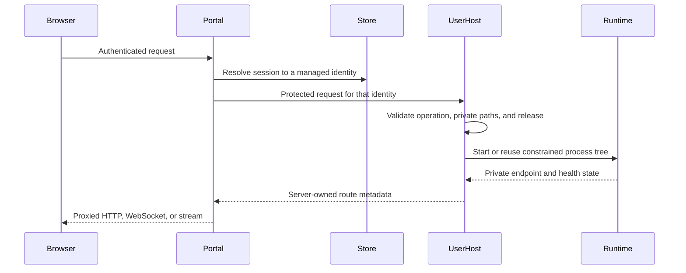

# Cross-platform architecture

## Goal

WorkAgent2 exposes a browser entry point while keeping every user's runtime, credentials, projects, files, and processes inside a platform-native identity boundary. Windows and Linux use different operating-system primitives, but enforce the same control-plane contract.

## Common component flow

## Shared responsibilities

| Layer | Responsibility |
|---|---|
| Browser and Portal | Login, session validation, request-shape validation, and public routing |
| Portal and UserHost | Server-selected user identity, protected control channel, and bounded messages |
| UserHost and filesystem | Private roots, ownership checks, quotas, and link/traversal defenses |
| UserHost and runtime | Verified releases, private configuration, process-tree lifecycle, and health |
| Portal and private runtime | Route ownership, streamed proxying, and credential non-disclosure |
| Control plane and providers | Stable provider IDs, model aliases, policy serialization, quotas, and bounded credentials |

## Platform mapping

| Concern | Windows | Linux |
|---|---|---|
| Tenant identity | Windows SID | Dedicated Linux UID |
| Control channel | Protected named pipe | Protected Unix socket |
| Filesystem boundary | NTFS ownership and ACLs | Ownership, ACLs, and XFS project quotas |
| Process boundary | Restricted token and Job Object | systemd service and cgroup |
| Private listeners | Loopback endpoints owned by the mapped route | Loopback or protected Unix-socket endpoints |
| Service management | Windows services and supervised processes | systemd units and per-user service instances |

## Common invariants

1. Browser-supplied usernames, paths, hostnames, and credentials are never authorization identities.
2. Filesystem, credential, OAuth, project, and runtime operations stay inside the mapped UserHost boundary.
3. Shared releases are immutable, selected explicitly, and verified against hash manifests before launch.
4. Plaintext secrets do not enter browser responses, logs, shared releases, or process arguments.
5. Provider identities, model aliases, keys, quotas, and usage remain bound to stable server-managed records.
6. Start, health, idle collection, rename, upgrade, rollback, and recovery are explicit state transitions.
7. Provisioning is isolated per account so unrelated users can initialize concurrently without sharing secret state.

## Platform documentation

- [Windows implementation](../windows/README.md) and [Windows architecture](../windows/docs/ARCHITECTURE.md)
- [Linux implementation](../linux/README.md) and [Linux architecture](../linux/docs/ARCHITECTURE.md)
- [Shared runtime patches](../patches/README.md)

Passing repository tests is not a production security certification. Each deployment must verify its real identities, ownership and ACL inheritance, quotas, network boundary, callbacks, provider access, release hashes, upgrade path, and rollback evidence.
