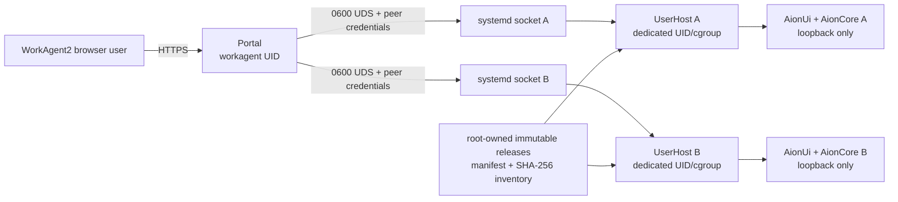

# Linux architecture

## Identity and storage

- `tenant_id` is a canonical immutable UUID used in database records, configuration filenames, socket names and audit events.
- `runtime_user` is a locked, passwordless Linux account mapped to one tenant; Portal and tenant UIDs must differ.
- Runtime accounts use a same-name primary group, a nologin shell and no supplementary group other than the capacity group. Provisioning, service preflight and blank-host recovery verify this shape; root-only checks also verify the password lock.
- A tenant data root is owned by its runtime UID with mode 0700. Portal is additionally denied the complete tenant tree by systemd.
- Tenant JSON remains root-owned 0640 for Portal administration. POSIX ACLs grant only the matching runtime UID read access to its file and execute-only traversal through the configuration directories.
- `openat2` uses `RESOLVE_BENEATH`, `RESOLVE_NO_SYMLINKS`, `RESOLVE_NO_MAGICLINKS` and `RESOLVE_NO_XDEV`; unsupported kernels fail closed.
- Production adds one XFS project ID and hard quota per tenant. The current root mount does not yet provide that layer.

## IPC and process boundary

- systemd owns each 0600 socket as the Portal UID and activates exactly one UserHost service per tenant.
- With socket activation, the Portal observes PID 1/root as the listening peer. It accepts that case only when peer PID is 1, peer UID is 0, the socket inode owner equals the configured Portal UID, mode is private and socket activation is explicitly configured.
- On the accepted side, UserHost independently verifies the connecting peer UID equals the Portal UID. Requests also carry a server-overwritten internal tenant binding.
- Releases are root-owned, non-writable, target-locked and fully enumerated by SHA-256 manifest; symlinks and unlisted files fail verification.
- cgroup v2 enforces `MemoryHigh`, `MemoryMax`, `CPUQuota`, `TasksMax` and control-group cleanup.
- A root-created global lease set counts actual UserHost lifetimes. Portal and tenant maxima must match and can be configured from 1 to 1000; the host deployment default remains 3.
- UserHost continuously verifies the release backend executable, its process tree, the single AionCore loopback listener and the AionCore health version derived from the release component manifest.
- Each UserHost lifetime generates a fresh canonical 32-byte transport credential in memory. The credential is never placed in an environment: UserHost puts only the non-secret tenant and fd3 markers in AionUi's initial environment and sends the credential over one anonymous socket packet. AionUi removes the markers from its mutable child environment, although Linux `/proc` still exposes those non-secret initial bytes; AionCore byte-scrubs its tenant, fd and removed legacy-token entries from the initial environment before creating worker threads. UserHost removes every browser-supplied `X-WorkAgent-*` header before injecting only the trusted runtime header. The credential is never passed to Agent CLI processes, persisted or logged, and is zeroed only after HTTP handlers and hijacked WebSocket tunnels have stopped.
- Portal cookies, browser authorization and CSRF headers are stripped before proxying. Tenant `Set-Cookie` responses are removed.

## Network boundary

- Staging terminates TLS directly on loopback port 42580.
- Production must expose only shared HTTPS 443 and proxy to a cleartext loopback TCP Portal listener. Direct Portal TLS and Unix Portal listeners are rejected by the production-layout validator so the shared-proxy identity contract is unambiguous.
- Forwarded headers are accepted only from configured proxy CIDRs; unsafe requests and WebSocket upgrades require the exact public Origin.
- Tenant backend loopback ports are not public, but loopback alone is not treated as an identity boundary. AionUi and AionCore gate static files, API, feedback, health, raw WebSocket and STT paths with the per-service runtime credential before their normal application authentication. The root-only real-runtime qualification test executes direct requests as a second numeric UID and requires missing/wrong credentials to return 403 while the correct transport credential still cannot bypass AionCore JWT authentication.
- An optional approved HTTP/HTTPS outbound proxy is copied from Portal policy into every tenant. UserHost fixes `HTTP_PROXY`, `HTTPS_PROXY` and loopback `NO_PROXY`; tenant environment configuration cannot override them. MCP OAuth still validates public HTTPS targets before proxy use.
- Portal never receives Docker socket access.

## Legacy internal compatibility identifiers

WorkAgent2 is the only display brand. A small set of non-display identifiers is intentionally unchanged so migrated state and protected backups remain readable: the Go module path `github.com/linziyan1231-source/WorkAgent2/linux`, authenticated control headers under `X-WorkAgent-*`, locked tenant account names under `workagent_*`, tenant model-key IDs with the `workagent-` prefix, and the version-1 backup HKDF context. These values are confined to internal protocols or persisted compatibility contracts and must not be rendered as product or company names. Renaming any of them requires an explicit, versioned migration with backward-read support.
