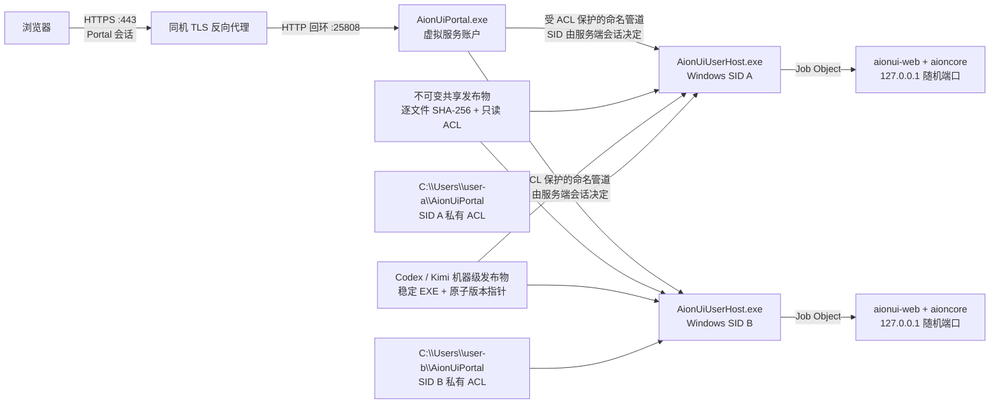

# AionUi Windows 多用户 Portal

本项目为 Windows Server 上的 AionUi 多用户入口提供一套静态 Go 控制平面、每 SID 隔离的 UserHost、不可变 AionUi Web 发布物，以及安装、升级、回滚和验证脚本。浏览器只访问一个 Portal；Portal 根据服务端会话选择 Windows SID，按需启动该 SID 的进程树，并把 HTTP 与 WebSocket 流量转发到仅监听回环地址的 AionUi Web CLI。

> 当前部署、回滚点和未解决问题见 [STATUS.md](STATUS.md)。公网入口应通过可信 HTTPS 访问；同机反向代理终止 TLS 时，Portal 只接受回环上游流量。

## 成功标准与边界

生产验收要求同时满足：

- Portal 以 `NT SERVICE\AionUiPortal` 运行；直接 TLS 模式监听 `0.0.0.0:25808`，反向代理 TLS 模式只监听 `127.0.0.1:25808`，外部 Cookie、HSTS 和 OAuth 回调均以 HTTPS 为准。
- 每个 Portal 用户一对一映射到现有、非管理员 Windows SID；Portal 密码和 Windows 密码彼此独立。
- 每个 SID 只运行一个 `AionUiUserHost.exe -> aionui-web.exe -> aioncore.exe` 进程树，内部端口只绑定 `127.0.0.1`，子进程受 Windows Job Object 限制。
- 用户私有数据固定在该 SID 注册的 `C:\Users\<Windows用户>\AionUiPortal`，每棵树由 FSRM 施加 20 GiB 硬配额；AionUi 与 Codex/Kimi/Python 分别位于 `C:\Program Files\AionUiWebShared` 和 `C:\Program Files\AionAgentCliShared`，均按清单逐文件校验和只读 ACL 保护。稳定的 `python.exe` 与 Codex/Kimi 共用机器 PATH，虚拟环境和其他可写 Python 数据仍属于各 SID 的私有树。
- CLIProxyAPI 以原生 Windows `cli-proxy-api.exe` 动态加载 `cpa-key-policy.dll`，员工模型流量和 Management API 都只走 Windows 回环；policy、Key/alias/配额和 OAuth auth-dir 由 Administrators/SYSTEM 保护。
- 登录、HTTP、WebSocket、停用、空闲回收、升级、回滚、凭据轮换和跨 SID 拒绝都通过真实 Windows 与浏览器验收。
- 所有要求的 OAuth 登录流都能在当前 Portal 会话中完成 state 绑定和回调校验。

OAuth 的代码与隔离测试已经成立，但真实平台可能拒绝公网 HTTP 回调；同时明文传输本身使原始生产保密标准不成立。因此即使 `readiness` 为 PASS，也不能把整套部署标记为生产安全验收通过。

CLIProxyAPI 只提供模型传输并保留工具调用；业务数据库访问必须由 Kimi Code、Aion Agent 或其他宿主提供 Shell/数据库 MCP 工具及独立凭据。AionCore 自身的 SQLite 是应用内部状态，不是业务数据库连接器。

## Kimi 专业数据库 MCP

WorkAgent2 可通过仅监听 `127.0.0.1:3211` 的 `AionKimiDatasourceBroker.exe`，把一份管理员持有的 Kimi Code 会员凭证安全地代理给指定员工。员工只获得各自随机令牌；中央代理按 Portal 用户强制执行数据源白名单、UTC 日/月调用上限和账号停用状态，且会自动刷新并原子轮换 Kimi access token。授权后，UserHost 会把托管 MCP 与 `kimi-professional-datasource` Skill 绑定到 WorkAgent 及已有对话；撤权后自动解绑。

首次部署二进制后，在提升权限的 PowerShell 中导入已登录 Kimi Code 的凭证并创建/更新代理服务：

```powershell
.\scripts\Configure-KimiDatasourceBroker.ps1 `
  -CredentialSource 'C:\Users\Administrator\.kimi\credentials\kimi-code.json'
```

管理员 GUI 的“账号管理 → Kimi 数据库权限”可设置员工白名单与额度。等价 CLI：

```powershell
portal.exe --config C:\ProgramData\AionUiPortal\portal.json kimi-datasource sources
portal.exe --config C:\ProgramData\AionUiPortal\portal.json kimi-datasource grant `
  --username test1 --sources arxiv,scholar,yuandian_law --daily 100 --monthly 1000
portal.exe --config C:\ProgramData\AionUiPortal\portal.json kimi-datasource show test1
portal.exe --config C:\ProgramData\AionUiPortal\portal.json kimi-datasource revoke test1
```

当前支持的官方数据源 ID 为：`stock_finance_data`、`yahoo_finance`、`world_bank_open_data`、`tianyancha`、`arxiv`、`scholar`、`yuandian_law`、`wind`、`imf`、`gildata`、`sec_edgar`、`sp_data`。共享个人会员账号可能受 Kimi 服务条款约束，正式长期使用前应改为组织许可或员工自己的账号。

## 架构



Portal 与 Windows 凭据边界如下：

| 凭据 | 用途 | 保存位置 |
|---|---|---|
| Portal 密码 | 浏览器登录 | Portal SQLite 中的 Argon2id 哈希 |
| Windows 密码 | Task Scheduler 的批处理登录 | 只通过交互式控制台传给 Task Scheduler/LSA；项目不保存明文 |
| AionUi 内部凭据 | Portal 到单个回环实例的认证 | 由该 SID 的 UserHost 管理；不会交给浏览器 |

## 目录

| 路径 | 内容 |
|---|---|
| `cmd/aionui-portal` | Windows 服务入口 |
| `cmd/aionui-userhost` | 每 SID 的进程监管器 |
| `cmd/portal` | 仅管理员可运行的运维 CLI |
| `cmd/aion-agent-cli` | 公共 `codex.exe`/`kimi.exe` 稳定启动器与管理员发布校验入口 |
| `cmd/kimi-datasource-broker` | Kimi 专业数据库的回环 MCP 策略代理与 OAuth 自动刷新服务 |
| `internal/portal` | 登录、会话、Renderer、HTTP/WebSocket 代理 |
| `internal/userhost` | 发布物验证、内部凭据、Job Object、健康与活动探测 |
| `internal/admin` | 用户、任务、ACL、升级和就绪检查 |
| `scripts` | 构建、安装、用户安装、升级、回滚、轮换、卸载和验证 |
| `artifacts/releases/<release-id>` | 按组件范围冻结的不可变制品、精确 EXE 子集与格式 2 构建清单 |

## 快速开始

在提升权限的 PowerShell 中构建。新装候选必须显式使用 `-FreshInstall`；升级候选必须先采集不含秘密的生产组件基线：

```powershell
.\scripts\New-UpgradeBaseline.ps1 `
  -OutputPath 'C:\release\baseline-20260721.json'
.\scripts\Build.ps1 `
  -ReleaseId 'portal-web-20260721' `
  -ReleaseScope combined `
  -UpgradeBaselinePath 'C:\release\baseline-20260721.json' `
  -GoExe .\.tools\go1.26.5\go\bin\go.exe `
  -SkipAionUiPack
.\scripts\Test-BuildArtifacts.ps1 `
  -BuildManifestPath '.\artifacts\releases\portal-web-20260721\build-manifest.json' `
  -ReleaseScope combined `
  -BinariesDirectory '.\artifacts\releases\portal-web-20260721\bin' `
  -AionUiPackedDirectory '..\AionUi\dist-web-cli\staging\aionui-web' `
  -AionUiVersion '2.1.29' -AionCoreVersion 'v0.1.42' `
  -RequireUpgradeContract
```

`web-only`、`runtime-only`、`backend-only` 和 `combined` 互不隐含；制品目录只允许出现清单声明的组件。升级前会比较“候选构建时的生产基线哈希”和当前安装哈希，拒绝用旧联合候选覆盖后来独立升级的组件。

当前 HTTP 安装前必须确保 `C:` 是 NTFS、每个 Windows 账户已有位于 `C:\Users` 的真实 Profile，并已明确接受公网明文传输风险。HTTPS 模式仍受支持，但需要匹配公开主机名的 PEM 证书/私钥。安装命令和验收顺序见 [PRODUCTION.md](PRODUCTION.md)。

## 文档

- [STATUS.md](STATUS.md)：当前部署、回滚点和未解决问题。
- [PRODUCTION.md](PRODUCTION.md)：生产安装、用户生命周期、升级与回滚。
- [SECURITY.md](SECURITY.md)：身份、密码、ACL、代理边界与剩余风险。
- [TROUBLESHOOTING.md](TROUBLESHOOTING.md)：常见错误和安全恢复步骤。
- [VALIDATION.md](VALIDATION.md)：本机证据、32 项验收矩阵和未完成项。
