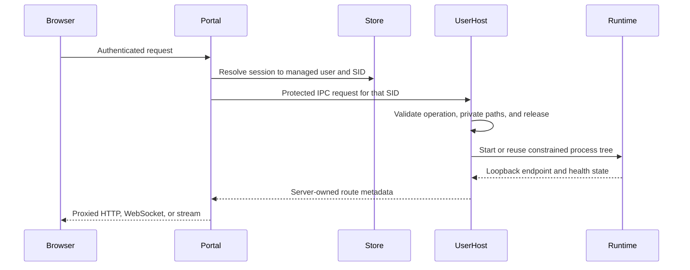

# Windows architecture

## Goal

WorkAgent2 exposes one browser entry point while keeping each Windows user's runtime, credentials, projects, and processes inside a SID-specific boundary. The core design question is not merely how to proxy traffic; it is how to prevent a browser request, another tenant, or a writable shared release from crossing that boundary.

## Component flow

## Trust boundaries

| Boundary | Responsibility |
|---|---|
| Browser ↔ Portal | Login, session validation, request shape, lexical input validation |
| Portal ↔ UserHost | Server-selected SID, protected IPC, bounded request/response types |
| UserHost ↔ filesystem | SID-private roots, ACL verification, quota and reparse-point defenses |
| UserHost ↔ runtime | Immutable release verification, private configuration, Job Object lifecycle |
| Portal ↔ loopback runtime | Route ownership, HTTP/WebSocket streaming, credential non-disclosure |
| Control plane ↔ providers | Stable provider IDs, aliases, policy serialization, bounded credentials |

## Principal invariants

1. **Tenant identity is a Windows SID.** Usernames and browser parameters are labels, not authorization identities.
2. **Private operations stay in UserHost.** Portal owns browser authentication and routing; filesystem, credentials, OAuth, projects, and processes are performed by the SID-specific host.
3. **Shared releases are immutable.** Runtime files are selected by a protected version pointer and checked against a hash manifest before use.
4. **Secrets use bounded channels.** Plaintext secrets are not accepted in shared files, process arguments, logs, or browser-visible data.
5. **Internal listeners are loopback-only.** Public origin, cookies, TLS, callbacks, and proxy behavior form one transport contract.
6. **Lifecycle is explicit.** Start, health, idle collection, rename, upgrade, rollback, and failure recovery are modeled as state transitions rather than best-effort shell actions.
7. **Provisioning is per account.** Each username has at most one active provisioning job, passwords stay outside job state, and unrelated employee accounts may initialize concurrently.

## Package responsibilities

- `internal/portal`: login and sessions, proxying, OAuth-facing routes, notifications, quotas, static content.
- `internal/admin` and `internal/provisionipc`: privileged account creation, resumable milestones, duplicate-job rejection, and bounded progress streaming.
- `internal/instance`: mapping managed users to UserHost routes and lifecycle state.
- `internal/ipc` and `internal/adminipc`: typed named-pipe protocols and servers.
- `internal/userhost`: private credentials, projects, runtime launch, activity, OAuth, and model defaults.
- `internal/winutil`: Windows-native identity, ACL, restricted-token, process, profile, TCP, and restart-manager helpers.
- `internal/release` and `internal/agentcli`: immutable releases, manifests, stable launchers, and version pointers.
- `internal/store`: SQLite-backed users, sessions, bindings, policies, and usage state.
- `internal/cliproxy`, `internal/chatgptproxy`, and `internal/portalusage`: provider transport, catalog convergence, stream inspection, and quota accounting.

## Verification strategy

Most security-sensitive packages pair implementation files with unit tests. Tests exercise malformed IPC, cross-user paths, auth state, proxy headers and streams, catalog convergence, release hashes, rollback behavior, and Windows resource controls. Selected PowerShell scripts add release-manifest contract checks.

Production acceptance requires more than this repository can show: real Windows accounts, service identities, ACL inheritance, filesystem quotas, provider callbacks, TLS, firewall policy, process races, upgrade snapshots, and rollback evidence must be verified in the target environment.

See the repository-level [cross-platform architecture](../../docs/ARCHITECTURE.md) for the shared contract and Linux mapping.
